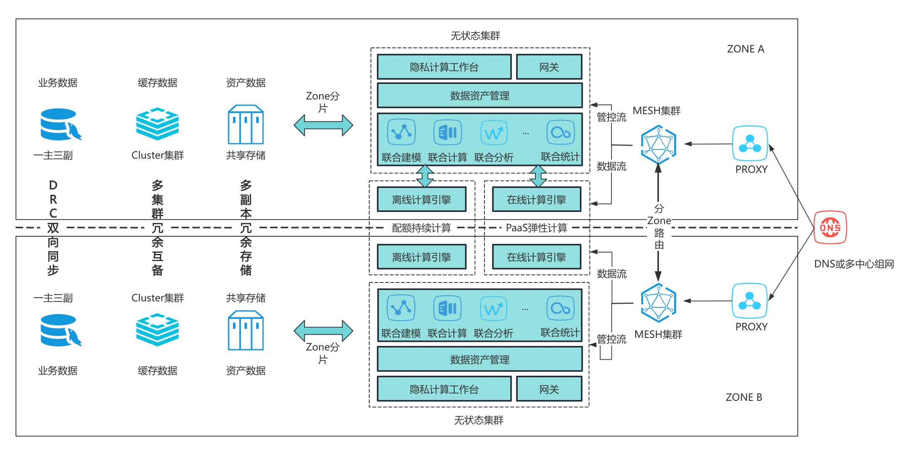

## 高可用

### 1. 架构设计

Mesh本身无状态支持高可用，作为互联互通枢纽，Mesh提供基于多数据中心设计的高可用架构提供类似多活的能力。每个Mesh集群代表一个逻辑数据中心，对外
提供服务，多个Mesh集群间通过环境变量`MESH_MDC`实现多数据中心间自动容灾切换。参考架构如下图：

> `MESH_MDC`：Mesh multi data center，多数据中心标识，用于指定多数据中心服务地址，格式为
`meshaddr1,meshaddr2,meshaddr3:7304`。



### 2. 网络配置

其中多数据中心对外提供的服务地址为多个，多中心的流量路由可以使用三种方式接入：
> 2.1. 域名解析：把所有多活Mesh集群地址作为DNS域名解析结果，通过DNS轮询方式进行流量分发。

> 2.2. 负载均衡：通过F5等负载均衡设备对外提供服务。

> 2.3. 内置能力：以`meshaddr1,meshaddr2,meshaddr3:7304`进行组网，Mesh自动进行顺序优先高可用转发。

若合作方也为Mesh集群，则推荐使用2.3方式接入。

### 3. 存储配置

Mesh中的组网数据存储在数据源中，数据源可以是

* 外部存储：数据库（MySQL、PG等），通过DSN配置进行配置。
* 内置存储：在不配置的情况下，默认使用内置KV结构存储在本地文件系统中。

因此如果不配置DSN，则需要给Mesh挂载持久化券，把组网数据持久化到文件系统。持久化目录可通过`MESH_HOME`指定，如环境变量为如下值：

```shell
MESH_HOME: /mesh
```

则持久化券可以为如下配置

```yaml
          volumeMounts:
            - name: data
              mountPath: /mesh
              subPath: data/{{ .Values.sets.mesh.name }}/data
```