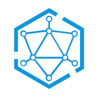

# Mesh: A lightweight, distributed, relational network architecture for MPC

[](https://opencollective.com/babel) [](https://codecov.io/gh/babel/babel)


Private Transmission Protocol -- PTP/1.0 [README](specifications/api/Specifications_CN.md)

中文版 [README](README_CN.md)

## Introduction

Mesh is an MPC network solution to serve resource as service.

## Features

As an open source network proxy, Mesh has the following core functions:

* Support full dynamic resource configuration through xDS API integrated with Service Mesh.
* Support proxy with TCP, HTTP, and RPC protocols.
* Support rich routing features.
* Support reliable upstream management and load balancing capabilities.
* Support network and protocol layer observability.
* Support mTLS and protocols on TLS.
* Support rich extension mechanism to provide highly customizable expansion capabilities.
* Support process smooth upgrade.

## Get Started

Install go compile time.

```bash
brew install go
```

Set the go dependency proxy host.

```bash
go env -w GOPROXY="https://mirrors.aliyun.com/goproxy/,https://goproxy.cn,https://goproxy.io,https://proxy.golang.org,direct"
```

Compile mesh project.

```bash
go mod tidy
```

Test project.

```bash
make test
```

Build distribute package for multiplatform.

```bash
make build
```

Generate software develop kits for C++, Python, Java, Golang language.

```bash
make babel
```

Release packages.

```bash
make publish
```

## Documentation

Mesh default listened port list. Mesh server boot with data port 7700 and control port 7305. These port communication
from node to node.

* 570 Mesh port in node
* 7304 Mesh port out node
* 80/443 Mesh port in panel

### Cli usage

```bash
# MacOS
brew install mesh

# CentOS
yum install mesh -y

# Alpine
apk add mesh

# Container
docker run -d bfia/mesh:latest
```

Mesh man usage

```bash
ducer@coyzeng mesh % ./bin/mesh --help

Usage:
  Mesh [flags]
  Mesh [command]

Examples:
mesh COMMAND

Available Commands:
  access      Mesh data access commands.
  babel       Mesh babel.
  completion  Generate the autocompletion script for the specified shell
  domain      Remove mesh net domains.
  dump        Dump the mesh cluster metadata tables.
  exec        Execute the mesh actor, Such mesh exec actor -i '{}'.
  help        Help about any command
  http        Mesh curl.
  inspect     Return low-level information on mesh plugin objects.
  issue       Mesh issue.
  kv          Mesh kv store.
  net         Display a live stream of mesh cluster resource usage statistics.
  os          Mesh OS 🚀🚀🚀.
  start       Start mesh with the run mode(server/operator/node/panel).
  status      Display a live stream of mesh cluster resource usage statistics.
  stop        Stop the mesh process if available.
  token       Mesh token center.

Flags:
  -c, --config string   Mesh configuration input, it can be url/path/body, default is {}. (default "{}")
  -d, --debug           Set the run mode to debug with more information.
  -f, --format string   Mesh configuration format, it can be json/yaml, default is yaml. (default "yaml")
  -h, --help            help for Mesh
  -v, --version         version for Mesh

Use "Mesh [command] --help" for more information about a command.
```

### Client usage

Golang

```bash
go get github.com/be-io/mesh/client/golang
```

Java

```xml

<dependency>
    <groupId>io.be.mesh</groupId>
    <artfactId>mesh</artfactId>
    <version>0.0.1</version>
</dependency>
```

Python

```bash
poetry add imesh

or

pip install imesh
```

Typescript

```bash
yarn add imesh
```

Rust

```bash
cargo add imesh
```
